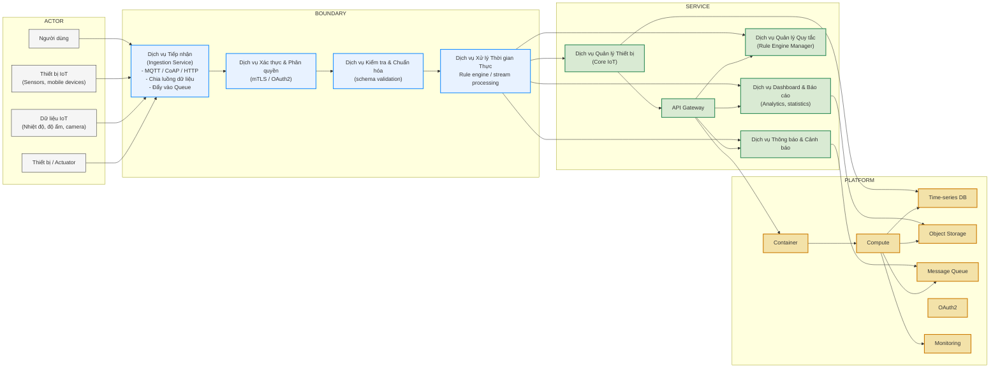

# SERVICE BOUNDARY DIAGRAM - HỆ THỐNG TIẾP NHẬN DỮ LIỆU IoT

**Đề tài:** Xây dựng dịch vụ tiếp nhận dữ liệu IoT

## 1. Thông tin chung

- Nhóm: Nhóm 3B
- Lớp: CNTT 1710
- Thành viên:
  - Hà Thị Phương Thanh
  - Đỗ Công Ngọc Sơn
  - Nguyễn Thị Thu Vui
  - Đinh Mạnh Đà
- Service phụ trách: IoT Ingestion Service
- Mục tiêu: Xây dựng dịch vụ nhận và quản lý dữ liệu sensor từ thiết bị IoT, cung cấp API cho hệ thống khác.

## 2. Actor

Các đối tượng bên ngoài tương tác với hệ thống:

- **Người dùng (User)**: Xem dữ liệu, trạng thái thiết bị
- **Thiết bị IoT (IoT Device)**: Gửi dữ liệu cảm biến
- **Dữ liệu IoT**: Nhiệt độ, độ ẩm, trạng thái thiết bị, metadata
- **Hệ thống khác / Service khác**: Frontend, Dashboard, AI Service

## 3. Boundary

### 3.1. Phần nhóm xây dựng

Dịch vụ IoT chịu trách nhiệm:

- **Dịch vụ tiếp nhận (Ingestion Service)**
  - Nhận kết nối từ thiết bị (HTTP / MQTT / CoAP)
  - Nhận dữ liệu cảm biến và trạng thái thiết bị
  - Đẩy dữ liệu vào hàng đợi hoặc xử lý ngay
- **Dịch vụ kiểm tra & chuẩn hóa**
  - Validate schema dữ liệu
  - Chuẩn hóa giá trị nhiệt độ, độ ẩm, trạng thái
- **Dịch vụ lưu trữ**
  - Lưu dữ liệu sensor vào database
  - Lưu thông tin thiết bị và metadata
- **Dịch vụ API**
  - Cung cấp endpoint để đọc dữ liệu và quản lý thiết bị
- **Dịch vụ giám sát**
  - Theo dõi trạng thái thiết bị
  - Kiểm tra health của service

### 3.2. Phần nhóm chỉ tích hợp

Những thành phần không tự xây dựng logic nhưng tích hợp:

- Frontend / Web App
- Auth Service / OAuth2
- AI Service
- Notification Service
- Hệ thống bên ngoài (Data Platform, Third-party API)

## 4. Service

### 4.1. Những gì Service làm

- Tiếp nhận dữ liệu IoT
- Lưu trữ dữ liệu cảm biến
- Cung cấp API truy vấn dữ liệu sensor và thiết bị
- Quản lý thông tin thiết bị
- Hỗ trợ health check `/health`

### 4.2. Những gì Service không làm

- Không xây dựng giao diện người dùng
- Không xử lý trực tiếp xác thực người dùng / đăng nhập
- Không thực hiện phân tích AI chuyên sâu
- Không gửi thông báo trực tiếp tới người dùng
- Không thay thế hệ thống lưu trữ thời gian thực ngoài nhóm

## 5. Platform

Các thành phần nền tảng hỗ trợ dịch vụ:

- Container / Docker
- Compute / Server
- Time-series DB hoặc database lưu sensor
- Object Storage (nếu cần lưu file/metadata)
- Message Queue (nếu dùng luồng/đệm dữ liệu)
- Monitoring / Logging

## 6. API dự kiến

| Method | Endpoint | Mục đích |
|---|---|---|
| GET | /health | Kiểm tra trạng thái service |
| POST | /iot/device | Thêm thiết bị mới |
| GET | /iot/device/{id} | Lấy thông tin thiết bị |
| PUT | /iot/device/{id} | Cập nhật thiết bị |
| DELETE | /iot/device/{id} | Xóa thiết bị |
| POST | /iot/data | Nhận dữ liệu sensor từ thiết bị |
| GET | /iot/data | Lấy dữ liệu sensor, hỗ trợ lọc theo device_id |

## 7. Input / Output

### Input

- Dữ liệu từ thiết bị IoT: nhiệt độ, độ ẩm, trạng thái, metadata
- Yêu cầu từ hệ thống khác: lấy dữ liệu, lấy thông tin thiết bị, quản lý thiết bị

### Output

- Dữ liệu sensor trả về dạng JSON
- Thông tin thiết bị trả về dạng JSON
- Kết quả health check
- API response chứa trạng thái thành công / lỗi

## 8. Sơ đồ tổng quan

### Ghi chú

- `ACTOR` là các thực thể bên ngoài: Người dùng, Thiết bị IoT, Dữ liệu IoT, Thiết bị/Actuator.
- `BOUNDARY` là vùng nhóm kiểm soát, gồm các service nhận, xác thực, kiểm tra và xử lý dữ liệu.
- `SERVICE` là các thành phần chức năng cốt lõi: API Gateway, quản lý thiết bị, cảnh báo, rule engine, dashboard.
- `PLATFORM` là hạ tầng triển khai: container, compute, database, storage, queue, auth và monitoring.
- Mũi tên từ `Actor` vào `Boundary` thể hiện luồng dữ liệu và yêu cầu đến hệ thống.
- Mũi tên từ `Boundary` sang `Service` thể hiện luồng xử lý nội bộ và phân phối dữ liệu.
- Mũi tên từ `Service` sang `Platform` thể hiện phụ thuộc hạ tầng.

### Giải thích sơ đồ

- `Dịch vụ Tiếp nhận` nhận dữ liệu từ thiết bị IoT và các nguồn dữ liệu bên ngoài.
- `Dịch vụ Xác thực & Phân quyền` đảm bảo dịch vụ chỉ xử lý request hợp lệ.
- `Dịch vụ Kiểm tra & Chuẩn hóa` xử lý việc validate schema và chuyển đổi dữ liệu.
- `Dịch vụ Xử lý Thời gian Thực` thực hiện rule engine và xử lý stream.
- `API Gateway` định tuyến request tới các dịch vụ nội bộ và cung cấp endpoint cho front-end.
- `Dịch vụ Quản lý Thiết bị` lưu trữ metadata thiết bị và cung cấp thông tin thiết bị.
- `Dịch vụ Thông báo & Cảnh báo` gửi cảnh báo khi dữ liệu vượt ngưỡng.
- `Dịch vụ Quản lý Quy tắc` chứa các rule và điều kiện xử lý dữ liệu.
- `Dịch vụ Dashboard & Báo cáo` hiển thị dữ liệu, thống kê và báo cáo.
- `Platform` là cơ sở hạ tầng: compute, database, storage, queue, auth, monitoring.

---

> Lưu ý: Sơ đồ này mô phỏng cấu trúc hình bạn gửi, với 4 cột `ACTOR`, `BOUNDARY`, `SERVICE`, `PLATFORM` và các luồng dữ liệu.
