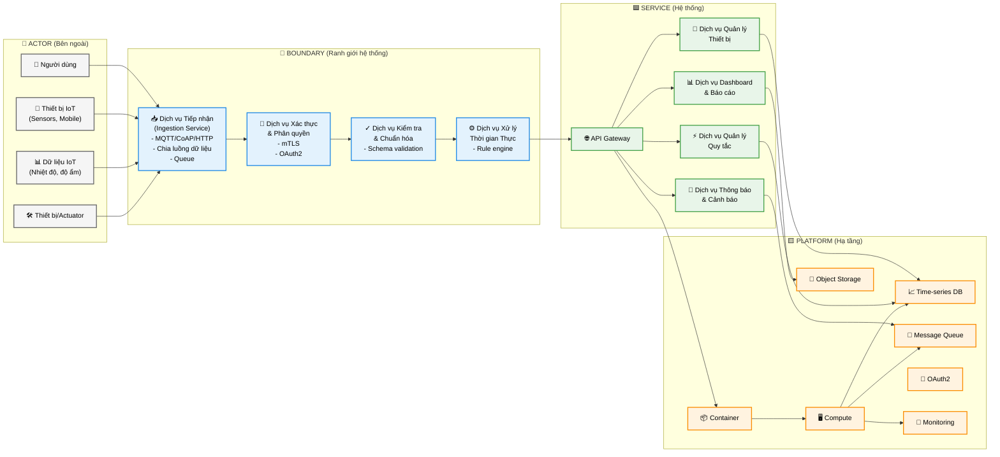

# SERVICE BOUNDARY DIAGRAM - HỆ THỐNG TIẾP NHẬN DỮ LIỆU IoT

**Đề tài:** Xây dựng dịch vụ tiếp nhận dữ liệu IoT

## 1. Thông tin chung

- Nhóm: Nhóm 3B
- Lớp: CNTT 1710
- Thành viên:
  - Hà Thị Phương Thanh
  - Đỗ Công Ngọc Sơn
  - Nguyễn Thị Thu Vui
  - Đinh Mạnh Đà
- Service phụ trách: IoT Ingestion Service
- Mục tiêu: Xây dựng dịch vụ nhận và quản lý dữ liệu sensor từ thiết bị IoT, cung cấp API cho hệ thống khác.

## 2. Actor

Các đối tượng bên ngoài tương tác với hệ thống:

- **Người dùng (User)**: Xem dữ liệu, trạng thái thiết bị
- **Thiết bị IoT (IoT Device)**: Gửi dữ liệu cảm biến
- **Dữ liệu IoT**: Nhiệt độ, độ ẩm, trạng thái thiết bị, metadata
- **Hệ thống khác / Service khác**: Frontend, Dashboard, AI Service

## 3. Boundary

### 3.1. Phần nhóm xây dựng

Dịch vụ IoT chịu trách nhiệm:

- **Dịch vụ tiếp nhận (Ingestion Service)**
  - Nhận kết nối từ thiết bị (HTTP / MQTT / CoAP)
  - Nhận dữ liệu cảm biến và trạng thái thiết bị
  - Đẩy dữ liệu vào hàng đợi hoặc xử lý ngay
- **Dịch vụ kiểm tra & chuẩn hóa**
  - Validate schema dữ liệu
  - Chuẩn hóa giá trị nhiệt độ, độ ẩm, trạng thái
- **Dịch vụ lưu trữ**
  - Lưu dữ liệu sensor vào database
  - Lưu thông tin thiết bị và metadata
- **Dịch vụ API**
  - Cung cấp endpoint để đọc dữ liệu và quản lý thiết bị
- **Dịch vụ giám sát**
  - Theo dõi trạng thái thiết bị
  - Kiểm tra health của service

### 3.2. Phần nhóm chỉ tích hợp

Những thành phần không tự xây dựng logic nhưng tích hợp:

- Frontend / Web App
- Auth Service / OAuth2
- AI Service
- Notification Service
- Hệ thống bên ngoài (Data Platform, Third-party API)

## 4. Service

### 4.1. Những gì Service làm

- Tiếp nhận dữ liệu IoT
- Lưu trữ dữ liệu cảm biến
- Cung cấp API truy vấn dữ liệu sensor và thiết bị
- Quản lý thông tin thiết bị
- Hỗ trợ health check `/health`

### 4.2. Những gì Service không làm

- Không xây dựng giao diện người dùng
- Không xử lý trực tiếp xác thực người dùng / đăng nhập
- Không thực hiện phân tích AI chuyên sâu
- Không gửi thông báo trực tiếp tới người dùng
- Không thay thế hệ thống lưu trữ thời gian thực ngoài nhóm

## 5. Platform

Các thành phần nền tảng hỗ trợ dịch vụ:

- Container / Docker
- Compute / Server
- Time-series DB hoặc database lưu sensor
- Object Storage (nếu cần lưu file/metadata)
- Message Queue (nếu dùng luồng/đệm dữ liệu)
- Monitoring / Logging

## 6. API dự kiến

| Method | Endpoint | Mục đích |
|---|---|---|
| GET | /health | Kiểm tra trạng thái service |
| POST | /iot/device | Thêm thiết bị mới |
| GET | /iot/device/{id} | Lấy thông tin thiết bị |
| PUT | /iot/device/{id} | Cập nhật thiết bị |
| DELETE | /iot/device/{id} | Xóa thiết bị |
| POST | /iot/data | Nhận dữ liệu sensor từ thiết bị |
| GET | /iot/data | Lấy dữ liệu sensor, hỗ trợ lọc theo device_id |

## 7. Input / Output

### Input

- Dữ liệu từ thiết bị IoT: nhiệt độ, độ ẩm, trạng thái, metadata
- Yêu cầu từ hệ thống khác: lấy dữ liệu, lấy thông tin thiết bị, quản lý thiết bị

### Output

- Dữ liệu sensor trả về dạng JSON
- Thông tin thiết bị trả về dạng JSON
- Kết quả health check
- API response chứa trạng thái thành công / lỗi

## 8. Sơ đồ Service Boundary Diagram

### Cấu trúc chi tiết

**ACTOR (Bên ngoài/Thực thể tương tác):**
- 👤 **Người dùng**: Xem dữ liệu, theo dõi trạng thái
- 📱 **Thiết bị IoT**:
  - Sensors (cảm biến nhiệt độ, độ ẩm)
  - Mobile devices (điện thoại, tablet)
- 📊 **Dữ liệu IoT**:
  - Nhiệt độ
  - Độ ẩm
  - Camera, GPS Tracker
- 🛠️ **Thiết bị/Actuator**: Điều khiển từ hệ thống

**BOUNDARY (Ranh giới / Phần nhóm xây dựng):**
- 📥 **Dịch vụ Tiếp nhận (Ingestion Service)**
  - Nhận dữ liệu từ MQTT/CoAP/HTTP
  - Chia luồng dữ liệu
  - Đẩy vào Queue
- 🔐 **Dịch vụ Xác thực & Phân quyền**
  - mTLS
  - OAuth2/Phân quyền truy cập
- ✓ **Dịch vụ Kiểm tra & Chuẩn hóa**
  - Schema validation
  - Chuẩn hóa giá trị
- ⚙️ **Dịch vụ Xử lý Thời gian Thực**
  - Rule engine
  - Stream processing

**SERVICE (Hệ thống / Hệ thống Tiếp nhận dữ liệu IoT):**
- 🌐 **API Gateway**: Định tuyến request
- 💾 **Dịch vụ Quản lý Thiết bị (Device Management)**
- 🔔 **Dịch vụ Thông báo & Cảnh báo**
- ⚡ **Dịch vụ Quản lý Quy tắc (Rule Engine Manager)**
- 📊 **Dịch vụ Dashboard & Báo cáo (Analytics)**

**PLATFORM (Nền tảng / Hạ tầng):**
- 📦 **Container**: Docker/Kubernetes
- 🖥️ **Compute**: Server, VM
- 📈 **Time-series DB**: InfluxDB, Prometheus
- 💾 **Object Storage**: S3, Cloud Storage
- 🚀 **Message Queue**: RabbitMQ, Kafka
- 🔑 **OAuth2**: Xác thực
- 📡 **Monitoring**: Logging, Metrics

### Sơ đồ Mermaid

### Ghi chú & Giải thích

**Cột ACTOR:**
- Các thực thể bên ngoài tương tác với hệ thống
- Bao gồm người dùng, thiết bị IoT, dữ liệu sensor, và thiết bị điều khiển

**Cột BOUNDARY (Ranh giới hệ thống):**
- Phạm vi nhóm xây dựng và quản lý
- Bao gồm dịch vụ tiếp nhận, xác thực, kiểm tra, và xử lý thời gian thực
- Đây là "lõi" chính của đề tài

**Cột SERVICE (Hệ thống tiếp nhận dữ liệu IoT):**
- Các chức năng nội bộ cung cấp giá trị cho người dùng
- API Gateway là điểm vào duy nhất
- Cung cấp các dịch vụ quản lý thiết bị, cảnh báo, rule engine, và dashboard

**Cột PLATFORM (Hạ tầng):**
- Môi trường triển khai và công nghệ hỗ trợ
- Container để đóng gói, compute để chạy, database để lưu trữ
- Message Queue để xử lý luồng dữ liệu bất đồng bộ
- Monitoring để theo dõi hệ thống

**Luồng dữ liệu chính:**
- Actor → Boundary: Dữ liệu từ thiết bị vào hệ thống
- Boundary → Service: Dữ liệu được xử lý và phân phối
- Service → Platform: Lưu trữ và triển khai

---

> **Lưu ý:** Biểu đồ này định nghĩa rõ ranh giới hệ thống IoT Service theo kiểu `ACTOR | BOUNDARY | SERVICE | PLATFORM`. Phạm vi chính của nhóm là `BOUNDARY` (xây dựng từ đầu) và `SERVICE` (các chức năng cơ bản), trong khi `PLATFORM` là hạ tầng hỗ trợ.
