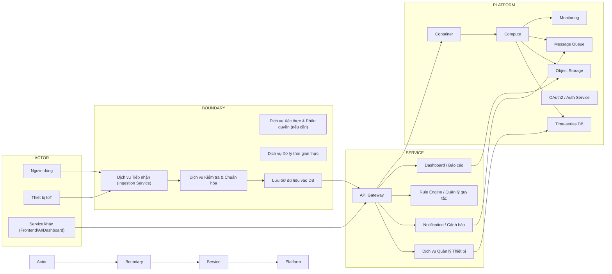

# SERVICE BOUNDARY DIAGRAM - HỆ THỐNG TIẾP NHẬN DỮ LIỆU IoT

**Đề tài:** Xây dựng dịch vụ tiếp nhận dữ liệu IoT

## 1. Thông tin chung

- Nhóm: Nhóm 3B
- Lớp: CNTT 1710
- Thành viên:
  - Hà Thị Phương Thanh
  - Đỗ Công Ngọc Sơn
  - Nguyễn Thị Thu Vui
  - Đinh Mạnh Đà
- Service phụ trách: IoT Ingestion Service
- Mục tiêu: Xây dựng dịch vụ nhận và quản lý dữ liệu sensor từ thiết bị IoT, cung cấp API cho hệ thống khác.

## 2. Actor

Các đối tượng bên ngoài tương tác với hệ thống:

- **Người dùng (User)**: Xem dữ liệu, trạng thái thiết bị
- **Thiết bị IoT (IoT Device)**: Gửi dữ liệu cảm biến
- **Dữ liệu IoT**: Nhiệt độ, độ ẩm, trạng thái thiết bị, metadata
- **Hệ thống khác / Service khác**: Frontend, Dashboard, AI Service

## 3. Boundary

### 3.1. Phần nhóm xây dựng

Dịch vụ IoT chịu trách nhiệm:

- **Dịch vụ tiếp nhận (Ingestion Service)**
  - Nhận kết nối từ thiết bị (HTTP / MQTT / CoAP)
  - Nhận dữ liệu cảm biến và trạng thái thiết bị
  - Đẩy dữ liệu vào hàng đợi hoặc xử lý ngay
- **Dịch vụ kiểm tra & chuẩn hóa**
  - Validate schema dữ liệu
  - Chuẩn hóa giá trị nhiệt độ, độ ẩm, trạng thái
- **Dịch vụ lưu trữ**
  - Lưu dữ liệu sensor vào database
  - Lưu thông tin thiết bị và metadata
- **Dịch vụ API**
  - Cung cấp endpoint để đọc dữ liệu và quản lý thiết bị
- **Dịch vụ giám sát**
  - Theo dõi trạng thái thiết bị
  - Kiểm tra health của service

### 3.2. Phần nhóm chỉ tích hợp

Những thành phần không tự xây dựng logic nhưng tích hợp:

- Frontend / Web App
- Auth Service / OAuth2
- AI Service
- Notification Service
- Hệ thống bên ngoài (Data Platform, Third-party API)

## 4. Service

### 4.1. Những gì Service làm

- Tiếp nhận dữ liệu IoT
- Lưu trữ dữ liệu cảm biến
- Cung cấp API truy vấn dữ liệu sensor và thiết bị
- Quản lý thông tin thiết bị
- Hỗ trợ health check `/health`

### 4.2. Những gì Service không làm

- Không xây dựng giao diện người dùng
- Không xử lý trực tiếp xác thực người dùng / đăng nhập
- Không thực hiện phân tích AI chuyên sâu
- Không gửi thông báo trực tiếp tới người dùng
- Không thay thế hệ thống lưu trữ thời gian thực ngoài nhóm

## 5. Platform

Các thành phần nền tảng hỗ trợ dịch vụ:

- Container / Docker
- Compute / Server
- Time-series DB hoặc database lưu sensor
- Object Storage (nếu cần lưu file/metadata)
- Message Queue (nếu dùng luồng/đệm dữ liệu)
- Monitoring / Logging

## 6. API dự kiến

| Method | Endpoint | Mục đích |
|---|---|---|
| GET | /health | Kiểm tra trạng thái service |
| POST | /iot/device | Thêm thiết bị mới |
| GET | /iot/device/{id} | Lấy thông tin thiết bị |
| PUT | /iot/device/{id} | Cập nhật thiết bị |
| DELETE | /iot/device/{id} | Xóa thiết bị |
| POST | /iot/data | Nhận dữ liệu sensor từ thiết bị |
| GET | /iot/data | Lấy dữ liệu sensor, hỗ trợ lọc theo device_id |

## 7. Input / Output

### Input

- Dữ liệu từ thiết bị IoT: nhiệt độ, độ ẩm, trạng thái, metadata
- Yêu cầu từ hệ thống khác: lấy dữ liệu, lấy thông tin thiết bị, quản lý thiết bị

### Output

- Dữ liệu sensor trả về dạng JSON
- Thông tin thiết bị trả về dạng JSON
- Kết quả health check
- API response chứa trạng thái thành công / lỗi

## 8. Sơ đồ tổng quan

### Ghi chú

- `ACTOR` là các thành phần bên ngoài hệ thống: người dùng, thiết bị IoT và hệ thống khác.
- `BOUNDARY` là phạm vi nhóm xây dựng, bao gồm toàn bộ luồng tiếp nhận, kiểm tra, chuẩn hóa, xử lý và lưu trữ dữ liệu.
- `SERVICE` là các chức năng nội bộ cung cấp API, quản lý thiết bị, cảnh báo và báo cáo.
- `PLATFORM` là môi trường triển khai và hạ tầng hỗ trợ dịch vụ.
- Mũi tên thể hiện luồng dữ liệu chính: từ thiết bị IoT vào dịch vụ, sau đó dịch vụ cung cấp dữ liệu cho hệ thống khác.
- Phần `Auth` chỉ là thành phần tham chiếu nếu cần tích hợp xác thực bên ngoài; service chính vẫn tập trung vào xử lý IoT.

### Giải thích sơ đồ

- `ACTOR`: Người dùng, thiết bị IoT, hệ thống khác tương tác với dịch vụ.
- `BOUNDARY`: Phần nhóm xây dựng, gồm nhận dữ liệu, kiểm tra, xử lý, lưu trữ.
- `SERVICE`: Các chức năng nội bộ như API, quản lý thiết bị, cảnh báo, dashboard.
- `PLATFORM`: Cơ sở hạ tầng hỗ trợ như container, database, queue, monitoring.
- Dòng `I --> Ingest` cho thấy thiết bị IoT gửi dữ liệu vào dịch vụ nhận.
- Dòng `Ingest --> Validate` cho thấy dữ liệu được kiểm tra/chuẩn hóa trước khi lưu.
- Dòng `Validate --> Store` cho thấy bước kiểm tra dữ liệu là cần thiết để tránh lưu dữ liệu không đúng định dạng.
- Dòng `Store --> APIGW` và `APIGW --> Core` cho thấy dữ liệu sau khi lưu có thể được truy vấn qua API.
- Dòng `APIGW --> Notify` và `APIGW --> Rule` cho thấy API cũng có thể kích hoạt cảnh báo hoặc quy tắc tự động.
- Dòng `APIGW --> Report` cho thấy dịch vụ dashboard/báo cáo sử dụng cùng dữ liệu đã lưu.

### Ghi chú bổ sung

- `Actor` gồm cả thiết bị IoT và người dùng, nhưng thiết bị IoT mới là nguồn dữ liệu chính.
- `Boundary` là phần nhóm xây dựng, nơi dịch vụ nhận và xử lý dữ liệu. Đây là phạm vi chính của đề tài.
- `Service` gồm các chức năng điều phối, cung cấp API và hỗ trợ các luồng nghiệp vụ như cảnh báo và báo cáo.
- `Platform` chỉ là hạ tầng hỗ trợ, không phải phần nhóm cần thiết kế chức năng nghiệp vụ.
- Mục tiêu chính của đề tài: xây dựng `IoT Ingestion Service`, còn `Auth Service`, `Notification Service` và `AI Service` là các tích hợp bên ngoài.

---

> Lưu ý: Đây là biểu đồ tổng quan dựa trên đề tài xây dựng dịch vụ tiếp nhận dữ liệu IoT. Nhóm phát triển chính phần `BOUNDARY` và `SERVICE`, còn `PLATFORM` là cơ sở hạ tầng triển khai.
